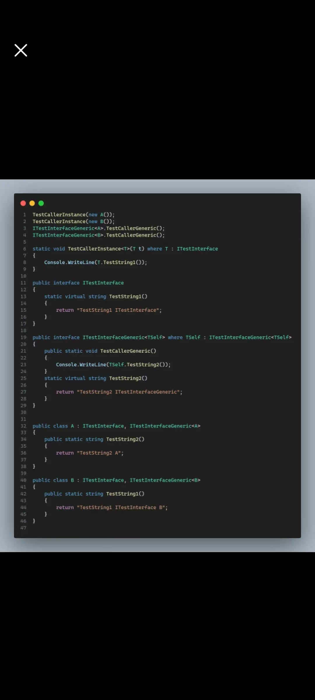

# 接口

> 经典：
>
> - 接口中只有公共方法的签名

> 现代：
>
> - 接口可以有属性
> - 接口可以有索引器
> - 接口可以有事件
> - 接口方法可以有默认实现
> - 接口可以有非公共成员
> - 接口可以有静态成员
> - 接口可以有抽象静态方法
> - 接口可以有虚静态方法

## 接口成员

```C#
namespace AllAboutInterface.Basics;

public interface IOverall
{
    // 最普通的方法
    void Foo();
  
    #region Top Secrets
    
    // 属性
    string Name { get; set; }
    
    // 索引器
    int this[int index] { get; set; }
    
    // 事件
    event EventHandler OnNameChanged;

    // 带默认实现的方法
    void Bar() => Console.WriteLine("Bar");

    // 私有方法（需要带默认实现）
    private void NonPublicMethod1()
    {
    }

    // 受保护方法（需要带默认实现）
    protected void NonPublicMethod2()
    {
    }

    // 静态方法（需要带默认实现）
    static void StaticMethod()
    {
        Console.WriteLine("StaticMethod");
    }

    // 抽象静态方法
    static abstract void AbstractStaticMethod();
    
    // 虚静态方法（需要带默认实现）
    static virtual void VirtualStaticMethod()
    {
        Console.WriteLine("VirtualStaticMethod");
    }
    
    #endregion
}
```

> Interface与class里面属性写的都是 get; set; 但意义是不同的：
>
> - 接口中的表示有一个名为 name 的属性。它拥有 public 的 getter 与setter，但并不知道它们是或者将会被怎样实现
> - 类中表示有一个名为name 的属性，它拥有 public 的 getter 与 setter，并且这是一个语法糖， 会自动生成一个后台对应的私有字段，然后将 gettre 与setter 对应到这个字段
>
> 索引

```C#
public interface C {
    public String name {get;set;}
}
public class B {
    public String name {get;set;}
}
```

```C#
[NullableContext(1)]
public interface C
{
    string name { get; set; }
}

[NullableContext(1)]
[Nullable(0)]
public class B
{
    [CompilerGenerated]
    [DebuggerBrowsable(DebuggerBrowsableState.Never)]
    private string <name>k__BackingField;

    public string name
    {
        [CompilerGenerated]
        get
        {
            return <name>k__BackingField;
        }
        [CompilerGenerated]
        set
        {
            <name>k__BackingField = value;
        }
    }
}

```

## 接口的显式实现

```C#
using System.Collections.ObjectModel;

namespace AllAboutInterface.Basics.ExplicitImpl;

interface IFoo1
{
    void Foo();
}

interface IFoo2
{
    void Foo();
}

/*
 * 如果多个接口包含签名相同的方法，那么类可以：
 * 1. 分别用显式实现的方式实现这些接口
 * 2. 使用传统的隐式实现，一次性实现两个接口中的方法
 */

class DemoClass1 : IFoo1, IFoo2
{
    // public void Foo()
    // {
    // }

    void IFoo1.Foo()
    {
        throw new NotImplementedException();
    }

    void IFoo2.Foo()
    {
        throw new NotImplementedException();
    }
}

class DemoClass2 : IFoo1, IFoo2
{
    // 这个方法不是来自于任意一个接口，而是 DemoClass2 自己的方法
    public void Foo()
    {
        
    }
}

class Usage
{
    public static void Demo()
    {
        var demo = new DemoClass1();
        ((IFoo1)demo).Foo();
        ((IFoo2)demo).Foo();
        CallFoo(demo);

        Display(new List<int>());
        Display(new int[0]);

        // var dict = new ReadOnlyDictionary<>();
        // ((IDictionary<>)dict).Add();
        
    }

    static void CallFoo(IFoo1 demo)
    {
        demo.Foo();
    }

    
    static void Display(int[] array)
    {
        foreach (var n in array)
        {
            Console.WriteLine(n);
        }
    }
    
    // 当我们此时只需要关注传入的参数，可以foreach，而不是根据索引获取值，或者是List的方法，所有此时使用IEnumerable
    static void Display(IEnumerable<int> array)
    {
        foreach (var n in array)
        {
            Console.WriteLine(n);
        }
    }
}
```

> ps:使用接口显式实现去隐藏方法

## 接口的默认实现

```C#

namespace AllAboutInterface.Basics.MethodWithDefaultImpl;

/*
 * C# 8.0 中引入了接口中的默认实现
 */

public interface IFoo1
{
    void Foo()
    {
        Console.WriteLine($"这是接口{nameof(IFoo1)}中的一个包含默认实现的方法");
    }

    void Bar()
    {
        Console.WriteLine($"这是接口{nameof(IFoo1)}中的另一个包含默认实现的方法");
    }
}

public interface IFoo2
{
    void Foo()
    {
        Console.WriteLine($"这是接口{nameof(IFoo2)}中的一个包含默认实现的方法");
    }
}

public class DemoClass1 : IFoo1, IFoo2
{
    // 实现了接口后，该类不必实现接口中包含默认实现的方法
    // 如果实现，那么接口中的默认实现将会直接被忽略

    // NOTE：因为一定会被忽略，所以被忽略的方法究竟出自哪个接口，是无所谓的

    public void Bar()
    {
        Console.WriteLine($"这是{nameof(DemoClass1)}类对于接口中带有默认实现的方法的实现");
    }
}

static class Usage
{
    public static void Demo()
    {
        var demo = new DemoClass1();

        // 类无法直接调用接口中的方法，需要显式使用接口对象
        // 因为编译器不能保证是否只有一个接口提供了这一签名的方法的默认实现
        // demo.MethodWIthImpl();
        ((IFoo1)demo).Foo();
        demo.Bar();
        
        // 由于类实现了接口中的方法，因此即便显式使用接口对象，也依旧会调用自己的实现
        ((IFoo1)demo).Bar();
    }
}
```


### 非公开方法的默认实现

```C#
namespace AllAboutInterface.Basics.NonPublicMembers;

interface IFooBase
{
    // 接口中的非公开方法必须给出默认实现
    private void PrivateMethod()
    {
        Console.WriteLine("IFooBase.PrivateMethod");
    }

    // private void Foo();

    // protected void Foo();

    protected void ProtectedMethod()
    {
        Console.WriteLine("IFooBase.ProtectedMethod");
    }
    
    void PublicMethod()
    {
        Console.WriteLine("IFooBase.PublicMethod");
        PrivateMethod();
        ProtectedMethod();
    }
}

interface IFoo : IFooBase
{
    void PublicMethod()
    {
        Console.WriteLine("IFoo.PublicMethod");
        // PrivateMethod(); // 错误：无法访问
        ProtectedMethod();
    }
}


partial interface IBar
{
    private partial void Bar();

    private extern void Foo();
}

partial interface IBar
{
    private partial void Bar()
    {
        
    }
}

class Foo : IFoo
{
    public void Foo1()
    {
        
    }
}

static class Usage
{
    public static void Demo()
    {
        var foo = new Foo();
        ((IFoo)foo).PublicMethod();
        ((IFooBase)foo).PublicMethod();
    }
}
```


## 接口的静态方法

```C#
using System.Text.Json;

namespace AllAboutInterface.Basics.StaticMethod;

interface IStaticMethod
{
    static void StaticMethod()
    {
        Console.WriteLine("IStaticMethod.Foo");
    }
}

class DemoClass : IStaticMethod
{
    
}

interface IDeserializable<T> where T : IDeserializable<T>
{
    static T? Deserialize(string json) => JsonSerializer.Deserialize<T>(json);
}

class Student : IDeserializable<Student>
{
    public int Id { get; set; }
    public string Name { get; set; }

    public override string ToString() => $"Id: {Id}, Name: {Name}";
}

class Usage
{
    public static void Demo()
    {
        // DemoClass.StaticMethod();
        IStaticMethod.StaticMethod();
        
        var student = IDeserializable<Student>.Deserialize("{\"Id\":42,\"Name\":\"Tom\"}");
        Console.WriteLine(student);
    }
}
```


## 接口的抽象静态方法

```C#
#nullable disable warnings

using System.Text.Json;

namespace AllAboutInterface.Basics.AbstractStaticMethod;

/*
 * 接口中的方法本身就类似于抽象类中的抽象方法，要求子类必须实现
 * 接口中允许存在静态方法，而静态方法又必须在接口中给出实现
 * 所以如果希望接口中存在可以不在接口中实现的静态方法，就需要声明为抽象方法
 */

interface IAbstractStaticMethod
{
    static abstract string Foo();
}

class DemoClass : IAbstractStaticMethod
{
    public static string Foo()
    {
        return nameof(DemoClass);
    }
}

#region 经典用法：Deserialize

interface IDeserializable<T> where T : IDeserializable<T>
{
    static abstract T Deserialize(string json);
}

class MyDataModel : IDeserializable<MyDataModel>
{
    public static MyDataModel Deserialize(string json)
    {
        return JsonSerializer.Deserialize<MyDataModel>(json);
    }
}

#endregion

#region 经典用法：Factory

interface IFactory<T>
{
    static abstract T Create();
}

class ClassToBeCreated
{
}

class ClassWithFactoryMethod : IFactory<ClassToBeCreated>
{
    private ClassWithFactoryMethod()
    {
    }

    public static ClassToBeCreated Create()
    {
        return new ClassToBeCreated();
    }
}

#endregion

#region 经典用法：Singleton

interface ISingleton<T> where T : ISingleton<T>
{
    static abstract T Instance { get; }
}

class SingletonClass : ISingleton<SingletonClass>
{
    // public static SingletonClass Instance { get; } = new SingletonClass();

    private static readonly Lazy<SingletonClass> _instanceHolder = new(() => new SingletonClass());
    public static SingletonClass Instance => _instanceHolder.Value;

    // public static SingletonClass Instance { get; } = new();
}

#endregion

#region 经典用法：Operators

interface IOperators<T> where T : IOperators<T>
{
    static abstract T operator +(T left, T right);
    static abstract T operator -(T left, T right);
}

class MyNumber : IOperators<MyNumber>
{
    public int Value { get; }

    public MyNumber(int value)
    {
        Value = value;
    }

    public static MyNumber operator +(MyNumber left, MyNumber right)
    {
        return new MyNumber(left.Value + right.Value);
    }

    public static MyNumber operator -(MyNumber left, MyNumber right)
    {
        return new MyNumber(left.Value - right.Value);
    }
}

#endregion

class Usage
{
    public static void Demo()
    {
        DemoClass.Foo();
    }
}
```

## 接口的静态虚方法


```C#

using System.Numerics;
using AllAboutInterface.Basics.ExplicitImpl;

namespace AllAboutInterface.Basics.VirtualStaticMethod;

interface IVirtualStaticMethod
{
    /// <summary>
    /// 一个接口中的静态虚方法（带有默认实现）
    /// </summary>
    static virtual void Foo()
    {
        Console.WriteLine("Foo from interface");
    }

    static void Bar()
    {
    }
}

interface IFoo : IVirtualStaticMethod
{
    static void Foo()
    {
        
    }
}

class DemoClass : IVirtualStaticMethod
{
    /// <inheritdoc cref="IVirtualStaticMethod.Foo"/>
    public static void Foo() // 无法使用 override 关键字
    {
        Console.WriteLine("Foo from class");
    }
}

static class Usage
{
    public static void Demo()
    {
        // IVirtualStaticMethod.Foo();
        DemoClass.Foo();
    }
}
```

`virtual`它的默认实现，无法调用，

它的意义：通常用于泛型调用的场合

虽然接口静态虚方法无法直接通过接口来获取，但可以通过泛型标记T来获取

```C#
```



# 接口的作用及意义

