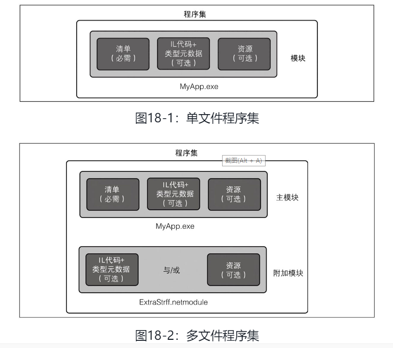
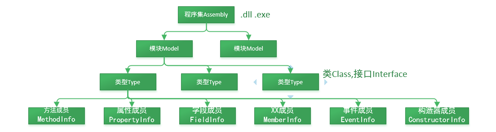

# 特性与反射


## 特性

### 概念

> 特性：提供了一种将元数据或声明性信息与代码相关联的强大方法。关联后，使用反射的技术在运行时查询该属性。
>
> PS：其实就是给我们的程序添加元数据的一种方法。这些元数据可以在运行时通过反射机制读取和使用

元数据：C# 编写的程序编译成一个程序集，程序集会包含元数据、编译代码和资源。
元数据包含内容：

- 程序或类库中每一个类型的描述；
- 清单信息，包括与程序本身有关的数据，以及它依赖的库；
- 在代码中嵌入的自定义特性，提供与特性所修饰的构造有关的额外信息。



`特性`具有以下特性：

- 特性将元数据添加到程序中。元数据是有关程序中定义的类型的信息。所有.NET 程序集都包含一组指定的元数据，这些元数据描述程序集中定义的类型和类型成员。可以添加自定义属性以指定所需的任何其它信息。
- 可以将一个或多个特性应用于整个程序集、模块或较小的程序元素（如类和属性）
- 特性可以像方法和属性一样接受参数
- 程序可以使用反射检查自己的元数据或其他程序中的元数据


常用的几种特性

```C#
// 标记方法或类已过时
[Obsolete("This method is obsolete. Use NewMethod instead.")]
public void OldMethod() { }

// 标记类可以序列化
[Serializable]
public class SerializableClass { }

// 用于引入非托管的DLL
[DllImport("user32.dll")]
public static extern int MessageBox(IntPtr hWnd, String text, String caption, uint type);

```

> PS：按照惯例，所有特性名称都以单词“Attribute”结尾
>
> 但是，在代码中使用属性时，无需指定属性后缀。例如， `[DllImport]` 等效于 `[DllImportAttribute]` ，但 `DllImportAttribute` 该属性在 .NET 类库中的实际名称。


### 自定义特性

#### 定义自定义特性

```C#
[AttributeUsage(AttributeTargets.Class | AttributeTargets.Method)]
public class MyCustomAttribute : Attribute
{
    public string Description { get; }

    public MyCustomAttribute(string description)
    {
        Description = description;
    }
}
```


```C#
namespace System
{
    /// <summary>
    /// Specifies the usage of another attribute class.
    /// </summary>
    [AttributeUsage(AttributeTargets.Class, Inherited = true)]
    public sealed class AttributeUsageAttribute : Attribute
    {
        private readonly AttributeTargets _attributeTarget;
        private bool _allowMultiple;
        private bool _inherited;
 
        internal static readonly AttributeUsageAttribute Default = new AttributeUsageAttribute(AttributeTargets.All);
 
        public AttributeUsageAttribute(AttributeTargets validOn)
        {
            _attributeTarget = validOn;
            _inherited = true;
        }
 
        internal AttributeUsageAttribute(AttributeTargets validOn, bool allowMultiple, bool inherited)
        {
            _attributeTarget = validOn;
            _allowMultiple = allowMultiple;
            _inherited = inherited;
        }
 
        public AttributeTargets ValidOn => _attributeTarget;
 
        public bool AllowMultiple
        {
            get => _allowMultiple;
            set => _allowMultiple = value;
        }
 
        public bool Inherited
        {
            get => _inherited;
            set => _inherited = value;
        }
    }
}
Document OutlineProject ExplorerNamespace Explorer
```

#### 应用范围、多重特性、继承


```C#
namespace System
{
    // Enum used to indicate all the elements of the
    // VOS it is valid to attach this element to.
    [Flags]
    public enum AttributeTargets
    {
        Assembly = 0x0001,
        Module = 0x0002,
        Class = 0x0004,
        Struct = 0x0008,
        Enum = 0x0010,
        Constructor = 0x0020,
        Method = 0x0040,
        Property = 0x0080,
        Field = 0x0100,
        Event = 0x0200,
        Interface = 0x0400,
        Parameter = 0x0800,
        Delegate = 0x1000,
        ReturnValue = 0x2000,
        GenericParameter = 0x4000,
 
        All = Assembly | Module | Class | Struct | Enum | Constructor |
                        Method | Property | Field | Event | Interface | Parameter |
                        Delegate | ReturnValue | GenericParameter
    }
}
Document OutlineProject ExplorerNamespace Explorer
```


#### 应用特性到程序元素

```C#
[MyCustomAttribute("This is a sample class with custom attribute.")]
public class SampleClass
{
    [MyCustomAttribute("This is a sample method with custom attribute.")]
    public void SampleMethod() { }
}

```


### 特性的实际应用

- 数据验证
- 日志记录
- 自动化验证
- 序列化与反序列化
- 依赖注入


## 反射

### 基本概念

> 反射：程序都是用于操作其它各种各样的数据，当我们需要操作程序本身的数据（元数据）的方法就叫做反射，允许程序在运行时检查和操作自身的元数据。

反射的用途：

- 获取类型信息

```C#
Type type = typeof(SampleClass);
Console.WriteLine("Full Name: " + type.FullName);
Console.WriteLine("Namespace: " + type.Namespace);

```


- 动态调用方法

```C#
Type type = typeof(SampleClass);
object instance = Activator.CreateInstance(type);
MethodInfo method = type.GetMethod("SampleMethod");
method.Invoke(instance, null);

```


- 动态访问属性和字段

```C#
Type type = typeof(SampleClass);
object instance = Activator.CreateInstance(type);
PropertyInfo property = type.GetProperty("SampleProperty");
object value = property.GetValue(instance);
property.SetValue(instance, newValue);

```


- 创建对象实例

```C#
Type type = typeof(SampleClass);
object instance = Activator.CreateInstance(type);

```


using System.Reflection

程序集包含了两种文件：可执行文件（.exe文件）和 类库文件（.dll文件）。

在VS开发环境中，一个解决方案可以包含多个项目，而每个项目就是一个程序集。

　　应用程序结构：包含 应用程序域（AppDomain），程序集（Assembly），模块（Module），类型（Type），成员（EventInfo、FieldInfo、MethodInfo、PropertyInfo） 几个层次。

　　他们之间是一种从属关系，也就是说，一个AppDomain能够包括N个Assembly，一个Assembly能够包括N个Module，一个Module能够包括N个Type，一个Type能够包括N个成员。他们都在System.Reflection命名空间下。【[公共语言运行库CLR](https://baike.baidu.com/item/公共语言运行库/2882128?fr=aladdin)】加载器 管理 应用程序域，这种管理包括 将每个程序集加载到相应的应用程序域 以及 控制每个程序集中类型层次结构的内存布局。 




  程序集信息其实是通过在程序集上应用各种Attribute来设置的，并且这些特性都位于System.Reflection命名空间，也就是这一系列Attribute提供给反射技术，可用于获取程序集的基本信息.

​    应用程序结构分为应用程序域—程序集—模块—类型—成员几个层次，公共语言运行库加载器管理应用程序域，这种管理包括将每个程序集加载到相应的应用程序域以及控制每个程序集中类型层次结构的内存布局。 
​    程序集包含模块，而模块包含类型，类型又包含成员，反射则提供了封装程序集、模块和类型的对象。我们可以使用反射动态地创建类型的实例，将类型绑定到现有对象或从现有对象中获取类型，然后调用类型的方法或访问其字段和属性。反射通常具有以下用途。 
（1）使用Assembly定义和加载程序集，加载在程序集清单中列出模块，以及从此程序集中查找类型并创建该类型的实例。 
（2）使用Module了解包含模块的程序集以及模块中的类等，还可以获取在模块上定义的所有全局方法或其他特定的非全局方法。 
（3）使用ConstructorInfo了解构造函数的名称、参数、访问修饰符（如pulic 或private）和实现详细信息（如abstract或virtual）等。使用Type的GetConstructors或GetConstructor方法来调用特定的构造函数。 
（4）使用MethodInfo了解方法的名称、返回类型、参数、访问修饰符（如pulic 或private）和实现详细信息（如abstract或virtual）等。使用Type的GetMethods或GetMethod方法来调用特定的方法。 
（5）使用FiedInfo了解字段的名称、访问修饰符（如public或private）和实现详细信息（如static）等，并获取或设置字段值。 
（6）使用EventInfo了解事件的名称、事件处理程序数据类型、自定义属性、声明类型和反射类型等，添加或移除事件处理程序。 
（7）使用PropertyInfo了解属性的名称、数据类型、声明类型、反射类型和只读或可写状态等，获取或设置属性值。

（8）使用ParameterInfo了解参数的名称、数据类型、是输入参数还是输出参数，以及参数在方法签名中的位置等。 

 


### 获取程序集对象（Assembly）


### 反射和特性

### 反射的高级用法

#### 加载程序集和模块

```
csharp复制代码Assembly assembly = Assembly.Load("AssemblyName");
Module[] modules = assembly.GetModules();
```

#### 动态代码生成

使用`System.Reflection.Emit`命名空间，可以在运行时生成并编译代码。

### 反射的实际应用

#### 动态插件系统

通过反射加载和调用插件程序集中的类型和方法。

#### 依赖注入框架

使用反射实现依赖注入，自动解析和注入依赖对象。

#### 序列化和反序列化

通过反射遍历对象的属性和字段，实现自定义的序列化和反序列化逻辑。


### 反射的性能考虑

#### 性能影响

反射操作通常比直接代码操作要慢，因此在性能关键的代码中应谨慎使用反射。

#### 优化策略

- 缓存反射结果
- 避免频繁使用反射


## 参考

https://www.cnblogs.com/whuanle/p/12115505.html#!comments

https://www.cnblogs.com/rohelm/archive/2012/04/19/2456088.html

https://learn.microsoft.com/en-us/dotnet/csharp/advanced-topics/reflection-and-attributes/

https://www.cnblogs.com/luna-hehe/p/10143748.html

https://www.cnblogs.com/czx1/p/201413137070-com.html
