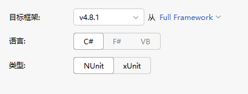
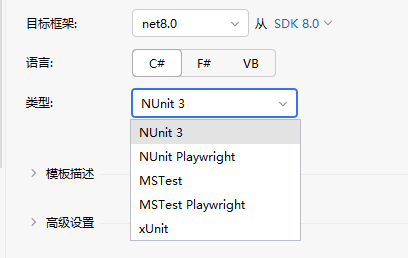

# 单元测试框架--Xunit

常用单元测试框架：MSTest (Visual Studio官方)、XUnit 和 NUnit。

1. MS Test为微软产品，集成在Visual Studio 2008+工具中。
2. NUnit为.Net开源测试框架（采用C#开发），广泛用于.Net平台的单元测试和回归测试中，官方网址([www.nunit.org](http://www.nunit.org/))。
3. XUnit.Net为NUnit的改进版。

