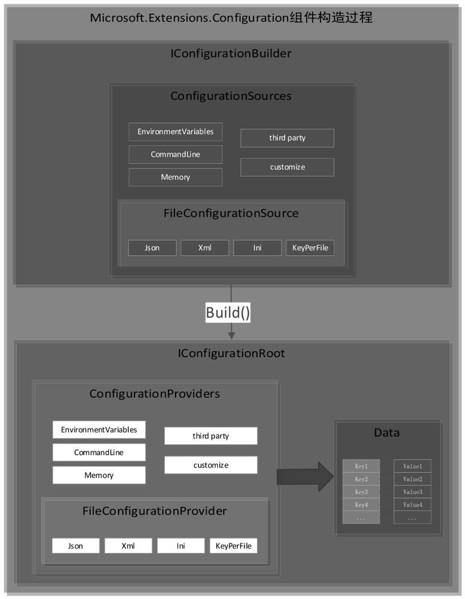

# 配置帮助类--Microsoft.Extensions.Configuration

> `Microsoft.Extensions.Configuration` 是一个用于管理应用程序配置的强大库，广泛应用于 .NET 应用程序中。它支持各种配置源（如 JSON 文件、XML 文件、环境变量、命令行参数等）以及将它们组合在一起。该库极大地简化了应用程序配置的管理和访问，尤其是在构建现代 .NET Core 和 .NET 5+ 的应用程序时。
>
> 配置组件的核心能力是从各种数据源读取并格式化为Key-Value（键-值）结构。

### 主要功能

- **支持多种配置源**：你可以从多个配置源读取配置，如 JSON 文件、XML 文件、环境变量、命令行参数等。
- **配置组合**：支持多个配置源的层叠组合，后面的配置可以覆盖前面的配置。
- **实时监控**：支持实时监控配置文件，当文件发生变化时可以自动重新加载配置。
- **绑定到强类型对象**：支持将配置数据绑定到强类型对象，便于使用。


PS：其实从名字就可以，`Microsoft.Extensions.Configuration`微软官方.扩展.配置类库

以下是主要类库：


## 读取各种配置源

`Microsoft.Extensions.Configuration` 提供了多种数据源的读取方式，包括 JSON 文件、XML 文件、环境变量、命令行参数、内存配置以及自定义配置源等。以下是每种数据源的读取方法及示例代码。

### 1. JSON 文件

方法：

使用 `AddJsonFile` 方法从 JSON 文件中读取配置。

示例：

```C#
var builder = new ConfigurationBuilder()
    .SetBasePath(Directory.GetCurrentDirectory())
    .AddJsonFile("appsettings.json", optional: true, reloadOnChange: true);

IConfiguration configuration = builder.Build();

string mySetting = configuration["MySetting"];
Console.WriteLine($"MySetting (from JSON): {mySetting}");
```

`appsettings.json` 文件内容：

```json
{
  "MySetting": "JsonValue"
}
```

### 2. XML 文件

方法：

使用 `AddXmlFile` 方法从 XML 文件中读取配置。

示例：

```C#
var builder = new ConfigurationBuilder()
    .SetBasePath(Directory.GetCurrentDirectory())
    .AddXmlFile("appsettings.xml", optional: true, reloadOnChange: true);

IConfiguration configuration = builder.Build();

string xmlSetting = configuration["XmlSetting"];
Console.WriteLine($"XmlSetting (from XML): {xmlSetting}");
```

`appsettings.xml` 文件内容：

```xml
<settings>
  <XmlSetting>XmlValue</XmlSetting>
</settings>
```

### 3. 环境变量

方法：

使用 `AddEnvironmentVariables` 方法从环境变量中读取配置。

示例：

```C#
var builder = new ConfigurationBuilder()
    .AddEnvironmentVariables(); // 不需要设置基路径

IConfiguration configuration = builder.Build();

string envSetting = configuration["EnvSetting"];
Console.WriteLine($"EnvSetting (from Environment Variables): {envSetting}");
```

设置环境变量并运行：

```bash
set EnvSetting=EnvValue
dotnet run
```

### 4. 命令行参数

方法：

使用 `AddCommandLine` 方法从命令行参数中读取配置。

示例：

```C#
var builder = new ConfigurationBuilder()
    .AddCommandLine(args);

IConfiguration configuration = builder.Build();

string cmdSetting = configuration["CmdSetting"];
Console.WriteLine($"CmdSetting (from Command Line): {cmdSetting}");
```

运行程序时传递参数：

```bash
dotnet run --CmdSetting=CmdValue
```

### 5. 内存配置

方法：

使用 `AddInMemoryCollection` 方法从内存字典中读取配置。

示例：

```C#
var inMemorySettings = new Dictionary<string, string>
{
    {"MemorySetting", "MemoryValue"}
};

var builder = new ConfigurationBuilder()
    .AddInMemoryCollection(inMemorySettings);

IConfiguration configuration = builder.Build();

string memorySetting = configuration["MemorySetting"];
Console.WriteLine($"MemorySetting (from In-Memory): {memorySetting}");
```

### 6. 自定义配置源

方法：

可以通过实现 `IConfigurationSource` 和 `IConfigurationProvider` 接口来创建自定义配置源。

示例：

首先，创建一个自定义的配置源和提供程序：

```C#
public class CustomConfigurationSource : IConfigurationSource
{
    public IConfigurationProvider Build(IConfigurationBuilder builder)
    {
        return new CustomConfigurationProvider();
    }
}

public class CustomConfigurationProvider : ConfigurationProvider
{
    public override void Load()
    {
        // 模拟加载自定义配置数据
        Data = new Dictionary<string, string>
        {
            {"CustomSetting", "CustomValue"}
        };
    }
}
```

然后，在 `ConfigurationBuilder` 中添加自定义配置源：

```C#
var builder = new ConfigurationBuilder()
    .Add(new CustomConfigurationSource());

IConfiguration configuration = builder.Build();

string customSetting = configuration["CustomSetting"];
Console.WriteLine($"CustomSetting (from Custom Source): {customSetting}");
```

### 7. INI 文件

方法：

使用 `AddIniFile` 方法从 INI 文件中读取配置。

示例：

```C#
var builder = new ConfigurationBuilder()
    .SetBasePath(Directory.GetCurrentDirectory())
    .AddIniFile("appsettings.ini", optional: true, reloadOnChange: true);

IConfiguration configuration = builder.Build();

string iniSetting = configuration["IniSetting"];
Console.WriteLine($"IniSetting (from INI): {iniSetting}");
```

`appsettings.ini` 文件内容：

```ini
[Settings]
IniSetting=IniValue
```

### 8. YAML 文件（第三方扩展）

虽然 .NET 不直接支持 YAML 文件，但是可以通过第三方库（如 `YamlDotNet.Extensions.Configuration`）来实现。

方法：

使用 `AddYamlFile` 方法从 YAML 文件中读取配置。

示例：

```C#
var builder = new ConfigurationBuilder()
    .SetBasePath(Directory.GetCurrentDirectory())
    .AddYamlFile("appsettings.yaml", optional: true, reloadOnChange: true);

IConfiguration configuration = builder.Build();

string yamlSetting = configuration["YamlSetting"];
Console.WriteLine($"YamlSetting (from YAML): {yamlSetting}");
```

`appsettings.yaml` 文件内容：

```yaml
YamlSetting: YamlValue
```

### 总结

`Microsoft.Extensions.Configuration` 支持多种配置源的读取，并且可以通过组合这些配置源来实现灵活的配置管理。无论是常用的 JSON 文件、环境变量、命令行参数，还是较少见的 XML、INI 文件、内存配置，甚至是自定义的配置源，都可以通过相应的方法轻松集成到应用程序中。


## 写入多种配置源

`Microsoft.Extensions.Configuration`主要设计用于从各种来源读取配置，但在某些情况下，我们可能需要在运行时修改或写入配置。写入配置的方式取决于配置源的类型。下面我将详细介绍如何针对不同的配置源写入或修改配置，包括具体的代码示例。


## 基本使用

为了更好地理解 `Microsoft.Extensions.Configuration` 的主要功能，以下是针对每个功能的具体实例代码。

### 1. 支持多种配置源

通过 `Microsoft.Extensions.Configuration`，可以从多个配置源读取配置，包括 JSON 文件、XML 文件、环境变量和命令行参数。

```C#
using Microsoft.Extensions.Configuration;
using System;
using System.IO;

class Program
{
    static void Main(string[] args)
    {
        var builder = new ConfigurationBuilder()
            .SetBasePath(Directory.GetCurrentDirectory())    // 设置基路径
            .AddJsonFile("appsettings.json", optional: true, reloadOnChange: true) // 添加 JSON 文件
            .AddXmlFile("appsettings.xml", optional: true, reloadOnChange: true)   // 添加 XML 文件
            .AddEnvironmentVariables()   // 添加环境变量
            .AddCommandLine(args);       // 添加命令行参数

        IConfiguration configuration = builder.Build();

        Console.WriteLine($"MySetting (from JSON): {configuration["MySetting"]}");
        Console.WriteLine($"MySetting (from XML): {configuration["XmlSetting"]}");
        Console.WriteLine($"MySetting (from EnvVar): {configuration["EnvSetting"]}");
    }
}
```

`appsettings.json` 文件内容：

```json
{
  "MySetting": "JsonValue"
}
```

`appsettings.xml` 文件内容：

```xml
<settings>
  <XmlSetting>XmlValue</XmlSetting>
</settings>
```

运行程序时，可以通过环境变量和命令行参数覆盖这些设置。

### 2. 配置组合

配置组合允许从多个源加载配置，并且后加载的配置会覆盖之前的配置。

```C#
using Microsoft.Extensions.Configuration;
using System;
using System.IO;

class Program
{
    static void Main(string[] args)
    {
        var builder = new ConfigurationBuilder()
            .SetBasePath(Directory.GetCurrentDirectory())
            .AddJsonFile("appsettings.json", optional: true, reloadOnChange: true)
            .AddJsonFile("appsettings.Development.json", optional: true, reloadOnChange: true) // 覆盖前一个配置文件
            .AddEnvironmentVariables();

        IConfiguration configuration = builder.Build();

        // 如果 appsettings.Development.json 文件存在并包含相同的键，则此处会覆盖 appsettings.json 的配置
        Console.WriteLine($"MySetting: {configuration["MySetting"]}");
    }
}
```

`appsettings.Development.json` 文件内容：

```json
{
  "MySetting": "DevelopmentValue"
}
```

在这个例子中，`MySetting` 的值将是 `"DevelopmentValue"`，因为 `appsettings.Development.json` 文件中的配置覆盖了 `appsettings.json` 中的相同键。

### 3. 实时监控

通过设置 `reloadOnChange: true`，可以实时监控配置文件的变化，并自动重新加载配置。

```C#
using Microsoft.Extensions.Configuration;
using System;
using System.IO;

class Program
{
    static void Main(string[] args)
    {
        var builder = new ConfigurationBuilder()
            .SetBasePath(Directory.GetCurrentDirectory())
            .AddJsonFile("appsettings.json", optional: true, reloadOnChange: true); // 实时监控文件变化

        IConfiguration configuration = builder.Build();

        while (true)
        {
            Console.WriteLine($"MySetting: {configuration["MySetting"]}");
            System.Threading.Thread.Sleep(5000); // 每隔5秒读取一次配置
        }
    }
}
```

在这个例子中，如果 `appsettings.json` 文件中的配置被修改，控制台将会在下一次读取配置时显示更新后的值，而不需要重新启动应用程序。

### 4. 绑定到强类型对象

你可以将配置绑定到一个强类型的对象中，这样可以方便地使用配置数据。

```C#
using Microsoft.Extensions.Configuration;
using System;
using System.IO;

public class MySettings
{
    public string MySetting { get; set; }
    public NestedSettings Nested { get; set; }
}

public class NestedSettings
{
    public string SubSetting { get; set; }
}

class Program
{
    static void Main(string[] args)
    {
        var builder = new ConfigurationBuilder()
            .SetBasePath(Directory.GetCurrentDirectory())
            .AddJsonFile("appsettings.json", optional: true, reloadOnChange: true);

        IConfiguration configuration = builder.Build();

        // 绑定到强类型对象
        var mySettings = new MySettings();
        configuration.Bind(mySettings);

        Console.WriteLine($"MySetting: {mySettings.MySetting}");
        Console.WriteLine($"Nested:SubSetting: {mySettings.Nested.SubSetting}");
    }
}
```

`appsettings.json` 文件内容：

```json
{
  "MySetting": "JsonValue",
  "Nested": {
    "SubSetting": "NestedValue"
  }
}
```

在这个例子中，配置被绑定到 `MySettings` 和 `NestedSettings` 对象，可以方便地通过属性访问配置数据。

### 总结

通过上述实例，展示了 `Microsoft.Extensions.Configuration` 的四个主要功能。这个库提供了强大的配置管理能力，可以让你轻松处理多种配置源，灵活组合配置，实时监控配置文件的变化，以及将配置绑定到强类型对象中，使得在 .NET 应用程序中管理配置变得更加方便和直观。


## 底层解析

配置组件的核心部分包含在下面两个组件包，通过接口实现分离

```C#
Microsoft.Extensions.Configuration.Abstractions
Microsoft.Extensions.Configuration

```


核心接口

```C#
IConfigurationBuilder，表示配置对象构造者，负责IConfigurationRoot的构造。
IConfigurationSource，表示一个配置数据源。
IConfigurationProvider，表示配置提供程序，负责从数据源读取配置数据并转换为Key-Value结构。
IConfiguration，表示配置对象，抽象为一个Key-Value结构。
IConfigurationRoot，表示配置对象的根，继承自IConfiguration。
IConfigurationSection，表示配置对象的一个节点，继承自IConfiguration。
```

整个配置组件构建过程：
创建IConfigurationBuilder。
向Builder中添加各种配置源（ConfigurationSource）。
通过Build方法构建IConfigurationRoot对象，其内部过程如下：
由ConfigurationSource的Build方法创建对应的ConfigurationProvider。
将ConfigurationProvider存储在ConfigurationRoot中。




最简单的几行代码，可以看出配置文件最基本的使用流程。

> 构建一个`ConfigurationBuilder`对象
>
> 添加配置资源(这里使用的是`InMemoryCollection`)
>
> 最后使用`Build()`方法生成`IConfigurationRoot`配置对象
>
> 使用`IConfigurationRoot`对象获取配置信息

 这里我们从这段代码中能看出`ConfigurationBuilder`是继承了`IConfigurationBuilder`这个接口，它`Build`出来的对象继承了`IConfigurationRoot`接口，`IConfigurationRoot`又继承了`IConfiguration`接口，而这些接口都位于`Microsoft.Extensions.Configuration.Abstractions`这个程序集中。

从`Microsoft.Extensions.Configuration.Abstraction`开始

从上图可以看出我们的`IConfigurationBuilder`中包含一个`IList<IConfigurationSource>`对象和`Add(IConfigurationSource source)`方法 ，这意味着ASP.NET core的配置对象是支持多配置源的。 `IConfigurationBuilder`通过`Build`方法，生成一个`IConfigurationRoot`对象，可通过实现父接口`IConfiguration`的索引器`this[string key]`获取到配置信息。对于`IConfigurationProvider`对象和`IConfigurationSection`我们通过对抽象的实现去探索。

进入`Microsoft.Extensions.Configuration`

##### `ConfigurationBuilder`

```go
	`Build`方法最终生成了`ConfigurationRoot`对象，并初始了`List<IConfigurationProvider>`。
public IConfigurationRoot Build()
{
	var providers = new List<IConfigurationProvider>();
	foreach (var source in Sources)
	{
		var provider = source.Build(this);
		providers.Add(provider);
	}
	return new ConfigurationRoot(providers);
}
```

 而`IConfigurationProvider`是由`IConfigurationSource`build生成的。

```c#
public IConfigurationBuilder Add(IConfigurationSource source)
{
	if (source == null)
	{
		throw new ArgumentNullException(nameof(source));
	}
	Sources.Add(source);
	return this;
}
```

##### ConfigurationRoot

 那配置信息时如何加载进去的呢？

 我们先看下配置信息是如何读取的，在索引器的`get`方法中，数据时是从`provider`中获取到的，而且在所有的`_providers`中倒序查找到`provider`后就会退出查找，这也意味着我们在添加多个配置源时，**最后添加的配置源会覆盖之前添加的配置源**，当然这是在键值相同的情况下。

```c#
public string this[string key]
{
	get
	{
		for (var i = _providers.Count - 1; i >= 0; i--)
		{
			var provider = _providers[i];
			if (provider.TryGet(key, out var value))
				return value;
		}
		return null;
	}
    set...
}
```

 那`provider`的数据是从哪里来的呢？在`ConfigurationProvider`这个类中，可以看到所有的数据都来源于`Data`这个`Dictionary<string, string>`字典集合。

 这个字典集合是什么时候加载的呢？

```csharp
public virtual bool TryGet(string key, out string value) 
	=> Data.TryGetValue(key, out value);
```

 在构造`ConfigurationRoot`对象时，我们看到所有的`provider`对象都调用了`Load()`方法。在`ConfigurationProvider`类中`Load()`方法是虚方法，且没有找到别的地方对`Data`这个变量进行赋值，那么这个时候可以猜想`ConfigurationProvider`继承类会重写这个方法，加载`Data`的值，那么我们去`MemoryConfigurationProvider`这个类中去验证一下，`MemoryConfigurationProvider`在构造函数中完成了`Data`的赋值，没有重写这个方法。汗~~~

```C#
public ConfigurationRoot(IList<IConfigurationProvider> providers)
{
    if (providers == null)
	{
		throw new ArgumentNullException(nameof(providers));
	}
    _providers = providers;
	_changeTokenRegistrations = new List<IDisposable>(providers.Count);
    foreach (var p in providers)
	{
		p.Load();
		_changeTokenRegistrations.Add(ChangeToken.OnChange(() =>p.GetReloadToken(),
    	() => RaiseChanged()));
	}
}
```

 那在这里先去漫游一下，通过`FileConfigurationProvider` => `JsonConfigurationProvider`找到了`Data = JsonConfigurationFileParser.Parse(stream)`，证明我们的猜想还是没有错的。

 这么一路抽丝剥茧，我们就知道了配置信息是如何运作的了！下一步我们看看配置文件是如何监视文件变化的，也对`FileConfigurationProvider`这一部分细化阅读一下。