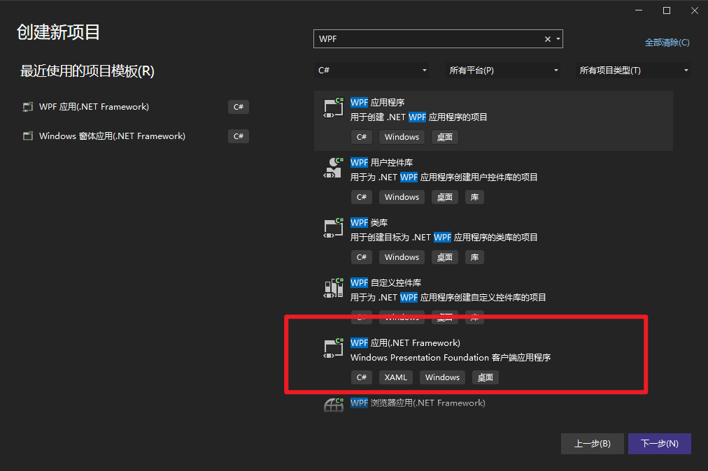
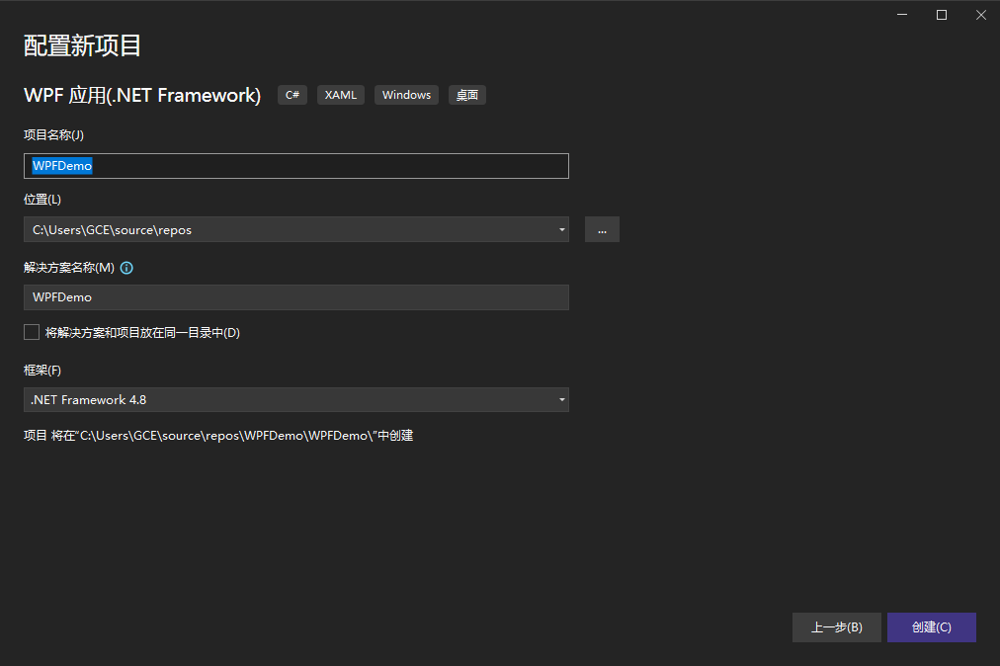
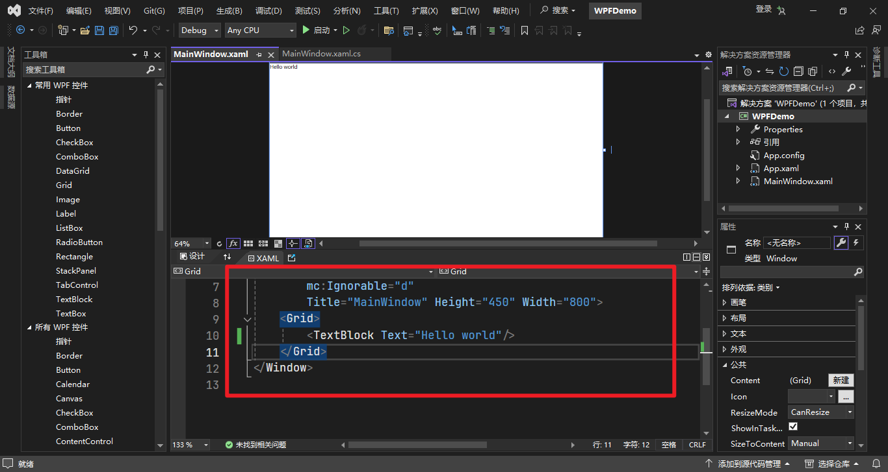
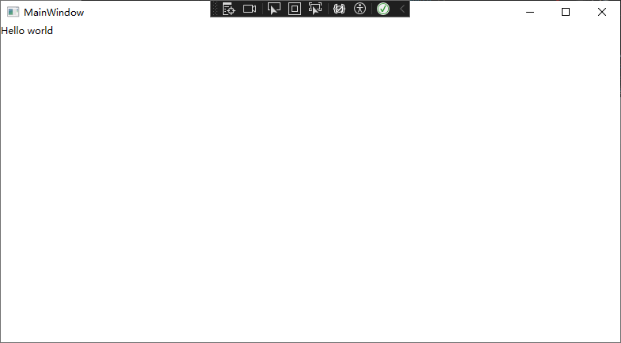
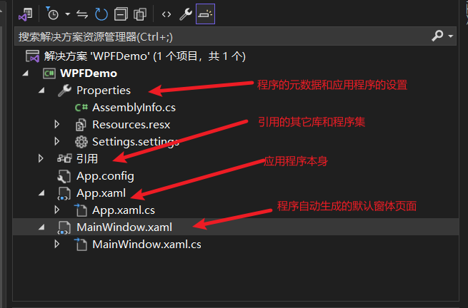
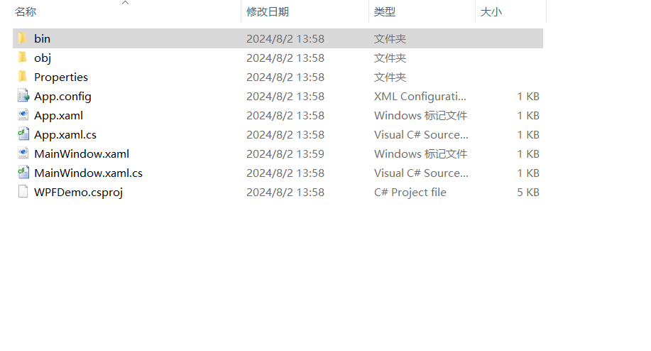

# WPF

## Hello World


第一步创建我们的WPF项目








修改我们的代码

```xaml
<Window x:Class="WPFDemo.MainWindow"
        xmlns="http://schemas.microsoft.com/winfx/2006/xaml/presentation"
        xmlns:x="http://schemas.microsoft.com/winfx/2006/xaml"
        xmlns:d="http://schemas.microsoft.com/expression/blend/2008"
        xmlns:mc="http://schemas.openxmlformats.org/markup-compatibility/2006"
        xmlns:local="clr-namespace:WPFDemo"
        mc:Ignorable="d"
        Title="MainWindow" Height="450" Width="800">
    <Grid>
        <TextBlock Text="Hello world"/>
    </Grid>
</Window>

```

点击启动或者按下F5，运行我们的程序



好的，我们的WPF程序运行成功了


回过头来，让我们看看我们的WPF项目




**Properties文件夹**

- **AssemblyInfo.cs**文件包含程序集的元数据，例如版本信息和版权信息。
- **Resources.resx**文件用于存储本地化字符串和其他资源。
- **Settings.settings**文件允许你定义应用程序的设置，这些设置可以在运行时读取和修改。

**References**

- 引用其他库和程序集，以便在项目中使用它们提供的功能。例如，可以引用System.Windows.Forms程序集来使用Windows窗体组件。

**App.xaml & App.xaml.cs**

- App.xaml文件定义了应用程序的根对象和资源字典，可以在整个应用程序中使用这些资源。App.xaml.cs文件包含应用程序的启动和退出逻辑。例如，可以在App.xaml.cs中处理Application_Startup事件来初始化应用程序。

**MainWindow.xaml & MainWindow.xaml.cs**

- MainWindow.xaml文件是应用程序的主界面，定义了窗口的布局和UI元素。MainWindow.xaml.cs文件则包含界面的交互逻辑，例如按钮点击事件的处理程序。




WPF 项目结构

一个典型的WPF项目结构如下：

1. **解决方案文件 (.sln)**
   - **作用**：这是Visual Studio创建的解决方案文件，用于管理项目的整体结构。解决方案文件包含一个或多个项目，并存储项目之间的依赖关系。
2. **项目文件 (.csproj)**
   - **作用**：这是C#项目文件，包含项目的配置信息，例如目标框架、依赖项、编译选项等。它定义了如何构建项目。
3. **App.xaml**
   - **作用**：这是应用程序的入口点，定义了全局资源和应用程序级别的事件处理程序。它引用一个关联的App.xaml.cs文件。
4. **App.xaml.cs**
   - **作用**：这是App.xaml的后台代码文件，包含应用程序启动、退出等全局事件的处理逻辑。
5. **MainWindow.xaml**
   - **作用**：这是应用程序的主窗口，使用XAML（eXtensible Application Markup Language）定义UI布局和界面元素。
6. **MainWindow.xaml.cs**
   - **作用**：这是MainWindow.xaml的后台代码文件，包含界面事件处理程序和业务逻辑代码。
7. **Properties文件夹**
   - **AssemblyInfo.cs**：包含程序集的元数据，如标题、描述、版本等。
   - **Resources.resx**：用于管理应用程序的本地化资源。
   - **Settings.settings**：用于管理应用程序的设置和配置。
8. **References**
   - **作用**：引用外部库和程序集，如.NET Framework库、第三方库等，以扩展项目的功能。
9. **Resources文件夹**
   - **作用**：存放项目的静态资源，如图片、图标等。
10. **bin文件夹**
    - **作用**：编译后生成的二进制文件存放的目录，分为Debug和Release两个子文件夹。
11. **obj文件夹**
    - **作用**：存放临时文件和编译过程中间文件。


## xaml

打开App.xaml

```xaml
<Application x:Class="WPFDemo.App"
             xmlns="http://schemas.microsoft.com/winfx/2006/xaml/presentation"
             xmlns:x="http://schemas.microsoft.com/winfx/2006/xaml"
             xmlns:local="clr-namespace:WPFDemo"
             StartupUri="MainWindow.xaml">
    <Application.Resources>
         <!-- 全局资源可以在这里定义 -->
    </Application.Resources>
</Application>

```

xaml语言是从xml语言发展而来

使用一对尖括号包括

#### 

- `<Application>` 元素：

  - x

    ：指定与此XAML文件关联的类。在这个例子中是

    ```
    WpfApp.App
    ```

    ，这个类位于

    ```
    App.xaml.cs
    ```

    文件中。

  - **xmlns**：这是默认命名空间，用于WPF的核心元素。

  - xmlns

    ：这是XAML命名空间，用于XAML的语言功能，例如类型转换和命名。

  - **StartupUri**：指定应用程序启动时的主窗口。在这个例子中是`MainWindow.xaml`。

- `<Application.Resources>` 元素：

  - 这个部分用于定义应用程序级别的资源（如样式、模板、颜色等），这些资源可以在整个应用程序中使用。


### 基本语法

**元素和属性**

XAML使用XML语法，其中每个UI元素都表示为一个XML元素。属性可以在开始标签中设置，也可以通过嵌套的子元素设置。

```xaml
xml
复制代码
<Button Content="Click Me" Width="100" Height="50"/>
```

或者：

```xaml
xml复制代码<Button Width="100" Height="50">
    <Button.Content>Click Me</Button.Content>
</Button>
```

**嵌套元素**

UI元素可以嵌套来形成层次结构。例如，一个`Grid`容器中可以包含多个`Button`元素。

```xaml
xml复制代码<Grid>
    <Button Content="Button 1" />
    <Button Content="Button 2" />
</Grid>
```

**资源**

资源可以在`<Application.Resources>`中定义，然后在其他地方引用。例如，定义一个颜色资源：

```xaml
xml复制代码<Application.Resources>
    <Color x:Key="PrimaryColor">#FF0000</Color>
</Application.Resources>
```

使用资源：

```xaml
xml
复制代码
<Button Background="{StaticResource PrimaryColor}" Content="Colored Button" />
```

**事件**

事件处理程序可以在XAML中定义，并在代码后文件中实现。例如：

```xaml
xml
复制代码
<Button Content="Click Me" Click="Button_Click" />
```

在代码后文件中：

```xaml
csharp复制代码private void Button_Click(object sender, RoutedEventArgs e)
{
    MessageBox.Show("Button was clicked!");
}
```

